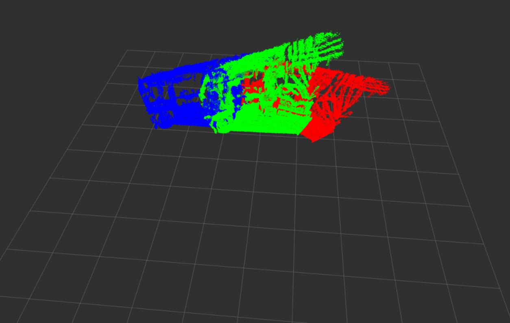

# pcl_regisration
A ROS 2 Package for Pointcloud (.pcd file) registration

## Requirements
- [ROS2 Humble](https://docs.ros.org/en/humble/Installation/Ubuntu-Install-Debians.html)
- [PCL Library](https://pointclouds.org/downloads/)

## Firstly create workspace:
```
mkdir -p ~/ros2_ws/src
cd ~/ros2_ws/src

```
## Clone this repository into the workspace
```
git clone https://github.com/hakanaktass/pcl_regisration.git
```
## Source and Build Workspace

```
source /opt/ros/humble/setup.bash
colcon build --symlink-install --cmake-args -DCMAKE_BUILD_TYPE=Release

```

## Parameters

Please update necessary paths on pcl_registration.param.yaml and update interface method on launch file. (ROS or PCL for visualization)

| Parameter Name                 | Description                                                     | value                                             |
| ------------------------------ | --------------------------------------------------------------- | ------------------------------------------------- |
| mode                           | ROS or PCL Visualization (Included in Launch file)              | "ROS" or "PCL" (string)                           |
| input_cloud_path               | Input cloud path                                                | absolute path for input pointcloud (string)       | 
| target_cloud_path              | Target cloud path                                               | absolute path for target pointcloud (string)      |
| output_cloud_path              | Output cloud path                                               | absolute path for outpu pointcloud (string)       |

## Launch 

If selected mode is "ROS" in launch file, then rviz2 is open and you can see different colors of pcd files and registration. If selected mode is equal to "PCL", then 2 pointclouds visualized on pcl_viewer.

```
source install/setup.bash
ros2 launch pcl_registration pcl_registration.launch.xml
```


## Results


